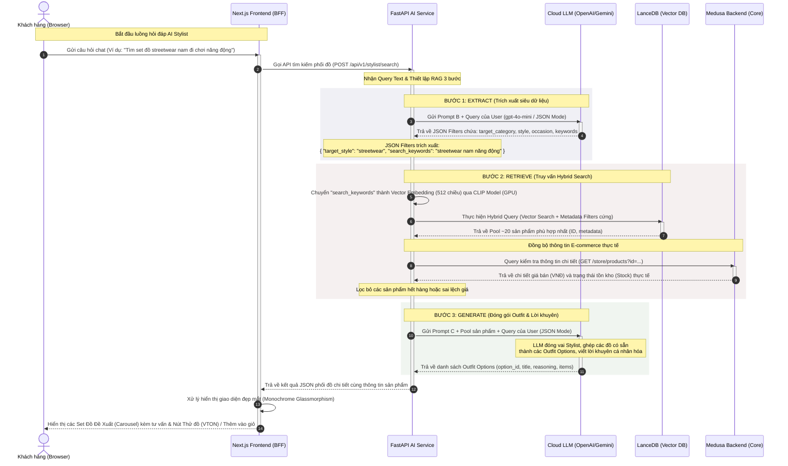

# Sơ đồ Sequence Chi tiết: Luồng Hỏi đáp với AI Stylist (RAG 3 bước)

Tài liệu này đặc tả chi tiết toàn bộ luồng tương tác và xử lý dữ liệu của tính năng **AI Stylist (Tư vấn phối đồ cá nhân hóa)**. Quy trình vận hành dựa trên kiến trúc **RAG 3 bước (Retrieval-Augmented Generation)** để đảm bảo tính cá nhân hóa cao, phản hồi nhanh chóng, và chống hiện tượng ảo giác (Zero Hallucination).

---

## 1. Kiến trúc Tổng quan & Công nghệ sử dụng

Hệ thống kết hợp các công nghệ hiện đại để tối ưu hóa hiệu năng trên phần cứng giới hạn vật lý và mang lại trải nghiệm tối ưu cho người dùng:
- **Next.js App Router (Frontend & BFF):** Tiếp nhận tương tác trực tiếp từ User, đóng vai trò API Gateway trung gian xử lý nghiệp vụ.
- **FastAPI AI Python Service:** Đầu não xử lý các thuật toán AI, quản lý mô hình Vector và giao tiếp với Vector DB.
- **LanceDB (Vector DB):** Lưu trữ vector nhúng của sản phẩm (512 chiều) và siêu dữ liệu (metadata), hỗ trợ Hybrid Search cực nhanh.
- **CLIP Multilingual Model (`clip-ViT-B-32-multilingual-v1`):** Mô hình nhúng đa ngôn ngữ chạy trên GPU, chuyển hóa văn bản tiếng Việt của khách hàng thành vector biểu diễn ngữ nghĩa.
- **Cloud LLM API (gpt-4o-mini / Gemini 1.5 Flash):** Xử lý ngôn ngữ tự nhiên, phân tích cú pháp truy vấn và tổng hợp phối đồ thời trang.
- **Medusa Backend (E-commerce Core):** Cung cấp dữ liệu tồn kho, giá bán và thông tin sản phẩm cập nhật theo thời gian thực.

---

## 2. Sơ đồ Sequence Mermaid (Mermaid Sequence Diagram)

Dưới đây là sơ đồ sequence thể hiện sự tương tác chi tiết giữa các thực thể trong toàn bộ vòng đời của một yêu cầu tư vấn phối đồ:



---

## 3. Giải thích Chi tiết Từng Bước Xử lý

### Bước 1: Trích xuất ý định (Extract Phase)
Khi nhận được câu hỏi từ khách hàng, **FastAPI AI Service** gửi yêu cầu đến **Cloud LLM API** cùng **Prompt B** để chuyển đổi câu hỏi phi cấu trúc thành dữ liệu JSON có cấu trúc.

> [!TIP]
> Việc trích xuất ý định này giúp hệ thống loại bỏ hoàn toàn các từ nhiễu (như: "hãy tìm cho tôi", "tôi muốn", "bạn ơi") và tập trung vào các tiêu chí lọc cốt lõi giúp tăng độ chính xác của database.

**Chi tiết Prompt B gửi lên LLM:**
```text
Bạn là hệ thống phân tích ngôn ngữ tự nhiên. Khách hàng vừa nhập yêu cầu tìm kiếm thời trang: "Tìm set đồ streetwear nam đi chơi năng động".
Hãy trích xuất yêu cầu này thành các bộ lọc JSON để hệ thống Database thực hiện tìm kiếm.
Nếu thông tin nào không được nhắc đến, hãy để null. Bắt buộc CHỈ trả về JSON.

Cấu trúc JSON yêu cầu:
{
  "target_category": "String | null",
  "target_occasion": "String | null",
  "target_style": "String | null",
  "price_preference": "String | null",
  "search_keywords": "String (Từ khóa cô đọng nhất dùng để tìm kiếm Vector, đã loại bỏ các từ nhiễu)"
}
```

**JSON Kết quả LLM trả về:**
```json
{
  "target_category": null,
  "target_occasion": "casual",
  "target_style": "streetwear",
  "price_preference": null,
  "search_keywords": "streetwear nam năng động đi chơi"
}
```

---

### Bước 2: Tìm kiếm và Lọc sản phẩm (Retrieve Phase)
Sau khi có JSON Filters, FastAPI kích hoạt tìm kiếm phức hợp:

1. **Sinh Vector nhúng (Embedding Generator):**
   Gửi chuỗi `"streetwear nam năng động đi chơi"` qua mô hình `clip-ViT-B-32-multilingual-v1` đang được duy trì hiệu năng cao trên GPU. Mô hình trả về một Vector float kích thước **512 chiều**.

2. **Truy vấn Hybrid Search trên LanceDB:**
   Sử dụng vector 512 chiều này để tìm kiếm tương đồng khoảng cách Cosine trên LanceDB. Đồng thời, áp dụng mệnh đề bộ lọc SQL (Metadata Filtering) dựa trên cấu trúc đã trích xuất:
   ```sql
   SELECT id, name, category, style, occasion 
   FROM products 
   WHERE (style = 'streetwear' OR occasion = 'casual') AND gender = 'male'
   ORDER BY cosine_similarity LIMIT 20
   ```

3. **Xác thực trạng thái E-commerce thời gian thực:**
   Để tránh giới thiệu những món đồ đã hết hàng hoặc sai giá, FastAPI gọi chéo sang **Medusa Backend** để đối chiếu. Những sản phẩm có `stock_quantity == 0` sẽ bị loại bỏ khỏi Pool để đảm bảo trải nghiệm mua sắm không bị gián đoạn.

---

### Bước 3: Tổng hợp và Tạo Set đồ (Generate Phase)
Sau khi có Pool khoảng 10-20 sản phẩm thực tế, FastAPI chuẩn bị **Prompt C** chứa toàn bộ thông tin chi tiết của các sản phẩm này và gửi lại cho Cloud LLM để thực hiện vai trò phối đồ nghệ thuật.

> [!IMPORTANT]
> **Quy tắc Chống Ảo Giác (Anti-Hallucination):** LLM bị ép buộc tuyệt đối phải chọn các ID sản phẩm có trong danh sách cung cấp. Nếu danh sách không đủ món đồ để tạo set đồ, LLM sẽ tự thiết kế set tối giản từ các món đồ hiện có thay vì tự bịa ra sản phẩm mới.

**Chi tiết dữ liệu đầu vào Prompt C:**
- **Available Products JSON:**
```json
[
  {"id": "prod_01JHG", "name": "Áo Hoodie Oversize Đen", "category": "tops", "style": ["streetwear"], "price": 450000},
  {"id": "prod_02KHF", "name": "Quần Jogger Cargo Xám", "category": "pants", "style": ["streetwear", "casual"], "price": 520000},
  {"id": "prod_03LJD", "name": "Áo Khoác Bomber Kaki", "category": "tops", "style": ["streetwear"], "price": 850000},
  {"id": "prod_04MKB", "name": "Giày Sneaker Chunky Trắng", "category": "shoes", "style": ["streetwear"], "price": 1200000}
]
```

**JSON Kết quả LLM trả về:**
```json
{
  "options": [
    {
      "option_id": "opt_streetwear_01",
      "title": "Năng động Đường phố Classic",
      "reasoning": "Sự kết hợp hoàn hảo giữa áo Hoodie Oversize đen cá tính và quần Jogger Cargo xám mang lại sự thoải mái tối đa cho các buổi đi chơi. Đôi Sneaker Chunky trắng tạo điểm nhấn tương phản nổi bật, đậm chất streetwear.",
      "items": ["prod_01JHG", "prod_02KHF", "prod_04MKB"]
    }
  ]
}
```

---

## 4. Định dạng Dữ liệu Trả về Đầu cuối (API Response Schema)

Dữ liệu trả về cho Frontend Next.js được đóng gói đầy đủ thông tin để Client có thể hiển thị trực quan ngay lập tức mà không cần thực hiện thêm bất kỳ truy vấn nào khác.

```json
{
  "status": "success",
  "data": {
    "query": "Tìm set đồ streetwear nam đi chơi năng động",
    "total_options": 1,
    "options": [
      {
        "option_id": "opt_streetwear_01",
        "title": "Năng động Đường phố Classic",
        "reasoning": "Sự kết hợp hoàn hảo giữa áo Hoodie Oversize đen cá tính và quần Jogger Cargo xám mang lại sự thoải mái tối đa cho các buổi đi chơi. Đôi Sneaker Chunky trắng tạo điểm nhấn tương phản nổi bật, đậm chất streetwear.",
        "items": [
          {
            "id": "prod_01JHG",
            "name": "Áo Hoodie Oversize Đen",
            "category": "tops",
            "thumbnail": "/images/products/hoodie-black.jpg",
            "price": 450000,
            "currency": "VND",
            "available_stock": 15,
            "variants": [
              {
                "variant_id": "variant_h_s",
                "title": "Size S",
                "inventory_quantity": 5
              },
              {
                "variant_id": "variant_h_m",
                "title": "Size M",
                "inventory_quantity": 10
              }
            ]
          },
          {
            "id": "prod_02KHF",
            "name": "Quần Jogger Cargo Xám",
            "category": "pants",
            "thumbnail": "/images/products/jogger-cargo.jpg",
            "price": 520000,
            "currency": "VND",
            "available_stock": 8,
            "variants": [
              {
                "variant_id": "variant_j_m",
                "title": "Size M",
                "inventory_quantity": 8
              }
            ]
          },
          {
            "id": "prod_04MKB",
            "name": "Giày Sneaker Chunky Trắng",
            "category": "shoes",
            "thumbnail": "/images/products/sneaker-white.jpg",
            "price": 1200000,
            "currency": "VND",
            "available_stock": 4,
            "variants": [
              {
                "variant_id": "variant_s_41",
                "title": "Size 41",
                "inventory_quantity": 4
              }
            ]
          }
        ]
      }
    ]
  }
}
```

---

## 5. Trải nghiệm Người dùng trên Frontend (UI/UX)

Sau khi Next.js nhận được gói dữ liệu từ API-02:
1. **Giao diện Glassmorphism Sang trọng:**
   Các set đồ được trình bày theo dạng thẻ trượt (Carousel) với viền kính mờ tinh tế trên nền tối tối giản.
2. **Hiển thị Phối đồ trực quan:**
   Mỗi set đồ hiển thị tổng số tiền (cộng gộp từ các item cấu thành) và sơ đồ kết hợp các sản phẩm.
3. **Tính năng Tương tác nhanh:**
   - **Nút Thử đồ VTON (Virtual Try-On):** Khi người dùng nhấp vào biểu tượng AI VTON lấp lánh trên set đồ, hệ thống sẽ tự động ghép ảnh người mẫu cá nhân của khách hàng với các trang phục trong set đồ và hiển thị kết quả trực quan thời gian thực qua SSE stream.
   - **Nút Thêm cả set vào Giỏ hàng:** Khách hàng có thể chọn kích cỡ (size) cho từng món đồ ngay tại drawer tư vấn và nhấn "Thêm set đồ vào giỏ" để chuyển toàn bộ set sang giỏ hàng của mình chỉ bằng 1 cú click.

---

> [!NOTE]
> Tài liệu kỹ thuật tham khảo thêm:
> - Xem cấu hình model tại [50_ai_model_specs.md](file:///.ai-knowledge/50_ai_model_specs.md)
> - Xem chi tiết system prompts tại [51_llm_config_prompts.md](file:///.ai-knowledge/51_llm_config_prompts.md)
> - Hợp đồng API chuẩn tại [11_api_contracts.yaml](file:///.ai-knowledge/11_api_contracts.yaml)
